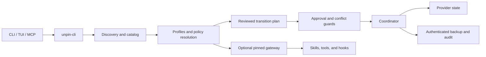

# Unpin onboarding

Choose the path that matches what you want to do:

- **Use an installed release:** follow the
  [README five-minute setup](../README.md#five-minute-local-setup), including
  the project-scoped skill and MCP toggle recipe.
- **Connect Unpin to an agent:** follow the
  [MCP setup guide](MCP.md) for Codex, Claude Code, Cursor, OpenCode, Zed, and
  the copy-ready automatic setup prompt. Then use the
  [capability-control prompt library](MCP-PROMPTS.md) for project allowlists,
  profiles, locks, hooks, sessions, and restore.
- **Understand or contribute to Unpin:** continue with this guide for the
  safety model, architecture, scope precedence, code tour, and
  fixture-isolated development workflow.

For the release-grade provider test procedure, use
[`local-provider-matrix.md`](local-provider-matrix.md).

## Project overview

Unpin is a Rust CLI/TUI that discovers and safely manages local AI-agent
configuration for Claude Code, Codex, Cursor, Pi, OpenCode, and Zed. It
normalizes provider-specific skills, MCP servers, plugins, hooks, agents, and
settings into one inventory.

Unpin `0.1.0-beta.5` hardens reusable inventory-group execution and adds
authenticated workspace-policy maintenance to the beta foundation. Release
artifacts are published only after required CI and provider evidence are
complete. GitHub Releases then provides
provenance-attested archives for Apple Silicon macOS, Intel macOS, and 64-bit
GNU/Linux. crates.io, package-manager distribution, and platform code signing
are deferred. The full fixture-backed matrix and available-host validation run
locally on macOS; CI also verifies supported build targets.

The central safety rule is plan first, apply the exact reviewed plan second.
Persistent writes require confirmation, an exact plan fingerprint, scoped
approval, conflict protection, authenticated backup evidence, audit evidence,
and a restore path.

## First safe run from source

Unpin requires Rust 1.96 or newer. The repository's development and CI
toolchain is pinned to Rust 1.97.1.

Release users do not need a source checkout or Rust toolchain; use the
[release installation and local setup](../README.md#distribution-status-and-quick-start)
instead.

```bash
cargo build --release --locked
./target/release/unpin --help
./target/release/unpin providers
./target/release/unpin doctor
./target/release/unpin list --json
```

The first four commands do not mutate provider configuration. To learn the
write workflow without touching live state, use the committed fixtures:

```bash
./target/release/unpin toggle \
  --fixture-root crates/unpin-core/tests/fixtures \
  --provider claude \
  --kind skill \
  --layer project \
  --id claude:project:skill:example-claude-skill
```

Review the returned target, effects, and fingerprint. An apply requires the
same selection plus `--apply --confirm --plan-fingerprint
PLAN_FINGERPRINT_FROM_DRY_RUN`.

Live writes and protected sessions use three purpose-separated keys in the OS
keychain:

```bash
./target/release/unpin auth backup init
./target/release/unpin auth approval init
./target/release/unpin auth session init
```

Fixture mode uses deterministic test keys and never opens the OS keychain.

## Architecture



| Layer | Responsibility | Start here |
| --- | --- | --- |
| CLI and TUI | Parse commands, render output, run interactive workflows, and supervise processes | [`crates/unpin-cli/src/main.rs`](../crates/unpin-cli/src/main.rs), [`crates/unpin-cli/src/tui.rs`](../crates/unpin-cli/src/tui.rs) |
| Provider inventory | Discover provider-native files and normalize them into typed records | [`discovery.rs`](../crates/unpin-core/src/discovery.rs), [`providers/registry.rs`](../crates/unpin-core/src/providers/registry.rs) |
| Catalog and policy | Track stable capabilities, immutable profiles, layered selection, and global locks | [`catalog/`](../crates/unpin-core/src/catalog), [`profiles/`](../crates/unpin-core/src/profiles) |
| Approval and transitions | Bind reviewed intent to immutable effects, execute safely, and record recovery state | [`approval.rs`](../crates/unpin-core/src/approval.rs), [`transitions/`](../crates/unpin-core/src/transitions) |
| Mutation and recovery | Perform format-aware provider changes, authenticated backups, rollback, and restore | [`mutation.rs`](../crates/unpin-core/src/mutation.rs), [`mutation/`](../crates/unpin-core/src/mutation) |
| Sessions and gateway | Pin policy revisions into leases and expose bounded skills/tools/hooks | [`sessions/`](../crates/unpin-core/src/sessions), [`gateway/`](../crates/unpin-core/src/gateway), [`mcp_runtime.rs`](../crates/unpin-cli/src/mcp_runtime.rs) |
| State | Resolve repository/worktree identity and persist private, atomic, revisioned JSON | [`state/workspace.rs`](../crates/unpin-core/src/state/workspace.rs), [`state/atomic_json.rs`](../crates/unpin-core/src/state/atomic_json.rs) |
| Verification | Prove behavior with fixtures, integration tests, the local matrix, and CI | [`crates/unpin-core/tests`](../crates/unpin-core/tests), [`crates/unpin-cli/tests`](../crates/unpin-cli/tests), [`scripts/`](../scripts) |

`unpin-core` owns headless product behavior. `unpin-cli` owns process concerns,
terminal interaction, credentials, and runtime transport. Core code must not
depend on terminal UI crates or process exits.

## Key concepts

### Capability and provider view

A capability is the normalized identity of a skill, tool, plugin, MCP server,
hook, agent, or setting. One physical source can have several provider views.
For example, a shared `.agents/skills` item may be visible to Codex, Cursor,
Pi, OpenCode, and Zed. A toggle changes the shared source once and refreshes
every view.

### Scope and precedence

Policy resolution uses replacement, not implicit merging:

| Precedence | Scope | Lifetime and identity |
| --- | --- | --- |
| 1 | Session | Ephemeral override pinned to one authenticated lease |
| 2 | Workspace/worktree | Durable policy for one physical Git checkout |
| 3 | Repository/project | Durable policy shared by all worktrees of one repository |
| 4 | Global | Durable user-machine default |
| 5 | Native default | Provider behavior when no explicit policy applies |

Provider-specific selection wins over generic selection at the same scope.
Global provider capability locks are applied after profile selection.

Branch names are context, not policy identities: switching branches in the same
physical checkout retains the workspace policy. Use a separate worktree when a
branch needs independent workspace policy or source-file isolation. Nested
folder policy is intentionally out of scope.

### Plan, approval, and transition

A plan is an immutable effect graph with a deterministic fingerprint. The
approval receipt binds human review to that plan, scope, resources, and current
state. Apply rechecks the binding, consumes replay protection, acquires conflict
guards, verifies drift, checkpoints a backup, and only then executes effects.

An exact retry may return a cached terminal result only after revalidating
current state. Divergence becomes `recovery-required`; it is never reported as
success.

Native toggle failures after backup creation also return
`recovery-required`, including the backup ID and a possible-write warning.
Inspect or restore that backup before attempting another mutation.

### Backups and restore

New provider mutation backups use manifest v3. The manifest authentication is
purpose-separated, payload trees are deterministically hashed, and restore
revalidates current targets before writing. Unauthenticated legacy v1 backups
are visible but not restorable until a trusted caller explicitly authenticates
their current contents.

### Native mode and gateway mode

Native mode is the default. The optional gateway compiles a pinned profile into
an immutable exposure for a session. Gateway installation, policy selection,
live host attachment, and runtime observation are separate facts; status does
not claim strict enforcement when the provider adapter cannot prove it.

MCP is a control plane, not an approval oracle. It can inventory and prepare
reviewed handoffs. Persistent writes are normally completed through the CLI or
TUI; the only MCP-side exception is an explicitly enabled persistent inventory
group apply using an exact short-lived artifact independently approved through
the CLI or TUI.

### Session diagnostics

Use `unpin auth session status`, `unpin session list --json`, and
`unpin gateway status --scope workspace --json` from the affected physical
worktree. The session inventory is deliberately worktree-scoped and redacted.
Compare desired and observed exposure revisions, then inspect `liveStatus`,
`coverage`, `lifecycle`, and `inFlightCalls`; degraded coverage or matching
revision strings alone must not be described as verified native attachment.

Session shutdown is plan-first through `unpin session end --id SESSION_ID
--json`, followed by the exact `--apply --confirm --plan-fingerprint` handoff.
Fencing closes admission, while the owner process retains cleanup
responsibility. Never repair a session by deleting Unpin-owned lease, overlay,
transaction, backup, or audit files. Preserve those files and stop when the
terminal status is `recovery-required`.

## Guided code tour

1. Read [`README.md`](../README.md) for public behavior and safety boundaries.
2. Read [`Cargo.toml`](../Cargo.toml) and
   [`crates/unpin-cli/src/main.rs`](../crates/unpin-cli/src/main.rs) to map the
   workspace and command surface.
3. Follow provider input through
   [`providers/registry.rs`](../crates/unpin-core/src/providers/registry.rs),
   [`discovery.rs`](../crates/unpin-core/src/discovery.rs), and
   [`catalog/model.rs`](../crates/unpin-core/src/catalog/model.rs).
4. Follow scope selection through
   [`profiles/policy_store.rs`](../crates/unpin-core/src/profiles/policy_store.rs)
   and [`profiles/resolver.rs`](../crates/unpin-core/src/profiles/resolver.rs).
5. Follow one write through
   [`transitions/plan.rs`](../crates/unpin-core/src/transitions/plan.rs),
   [`approval.rs`](../crates/unpin-core/src/approval.rs), and
   [`transitions/coordinator.rs`](../crates/unpin-core/src/transitions/coordinator.rs).
6. Study recovery in
   [`mutation/backup_authentication.rs`](../crates/unpin-core/src/mutation/backup_authentication.rs)
   and [`mutation/restore_control.rs`](../crates/unpin-core/src/mutation/restore_control.rs).
7. Study isolation in
   [`state/workspace.rs`](../crates/unpin-core/src/state/workspace.rs) and
   [`sessions/`](../crates/unpin-core/src/sessions).
8. Finish with fixture-backed contracts in
   [`capability-matrix.json`](../crates/unpin-core/tests/fixtures/capability-matrix.json),
   core integration tests, CLI integration tests, and the local provider matrix.

## Complexity hotspots

The architecture graph marks safety-critical orchestration as complex. Make
focused changes and run the nearest integration suite when touching these areas:

| Area | Why it is high risk | Minimum focused verification |
| --- | --- | --- |
| `mutation.rs` and `mutation/` | Provider-specific writes, backup formats, restore, rollback, and drift protection meet here | `cargo test -p unpin-core --test mutation --all-features --locked` |
| `transitions/` and `approval.rs` | Authorization, locking, journaling, replay protection, and recovery lifecycle | `cargo test -p unpin-core --test transitions --test approval --all-features --locked` |
| `sessions/`, `session_process.rs`, and gateway code | Authenticated leases, process supervision, admission, and cross-worktree conflicts | `cargo test -p unpin-core --test sessions --test gateway --all-features --locked` |
| `mcp.rs` and `mcp_runtime.rs` | JSON-RPC contracts, bounded transports, upstream credentials, and no-write handoff | `cargo test -p unpin-core --test mcp --all-features --locked` and `cargo test -p unpin-cli --test mcp_runtime --all-features --locked` |
| `discovery.rs` and provider fixtures | One normalization change can affect several provider views | Discovery, capability, and provider-registry integration tests |
| `tui.rs` and TUI workflows | Interactive state machines must preserve plan-confirm-apply semantics | CLI/TUI state tests and the local provider matrix |
| `scripts/local_provider_matrix_*.py` | Publication evidence, privacy filtering, PTY driving, and finalization | Full matrix plus screenshot review and finalization |

## Contribution workflow

1. Read [`CONTRIBUTING.md`](../CONTRIBUTING.md) and the nearest existing tests.
2. Add a fixture-backed regression test before changing public behavior.
3. Keep provider logic in `unpin-core` and interaction logic in `unpin-cli`.
4. Run focused tests, then the full local gates:

   ```bash
   cargo fmt --all -- --check
   cargo clippy --workspace --all-targets --all-features --locked -- -D warnings
   cargo test --workspace --all-features --locked
   cargo run -p unpin-cli --locked -- --help
   cargo audit --deny warnings
   cargo machete
   ```

5. Run `python3 scripts/run_local_provider_matrix.py` before distribution or
   after broad provider, mutation, TUI, MCP, backup, or restore changes.
6. Report the safety boundary touched, checks run, and any remaining limitation.

Automated tests and examples must never read or mutate real home-directory
provider state. Use committed fixtures and temporary directories, and never use
`.env*` files. The explicit local matrix is the exception for read-only host
validation: it hashes each selected item's live source/state paths immediately
before and after its no-write plan, persists only aggregates, and performs all
mutations against isolated fixture copies.
