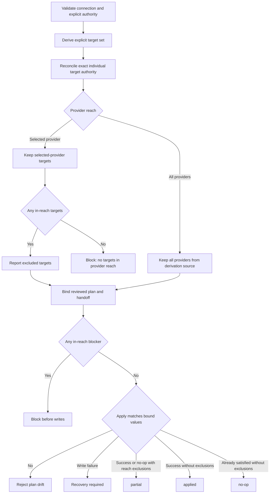
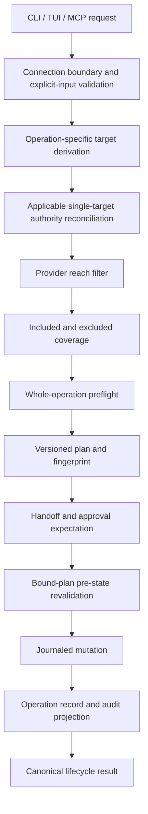
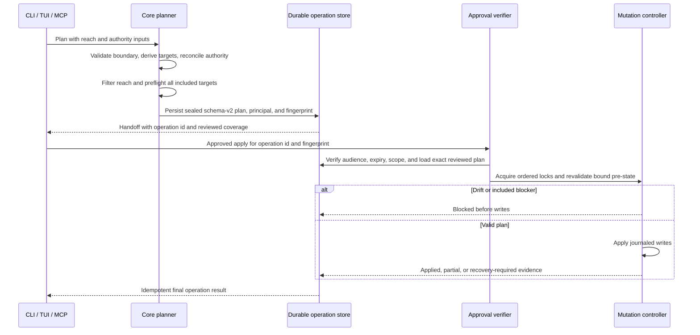
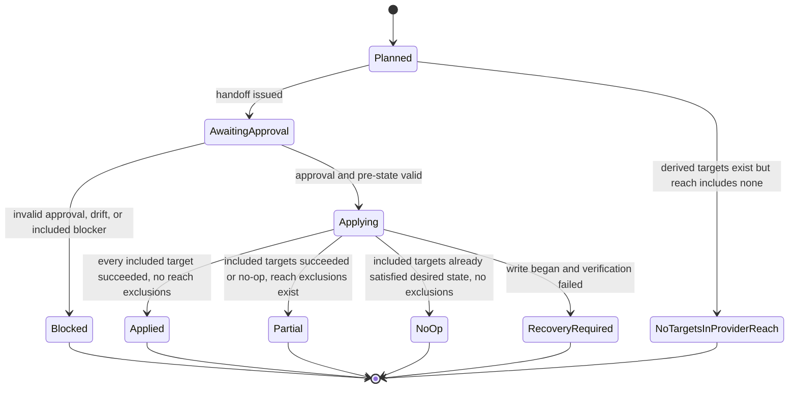

# Provider Reach - Plan

## Goal Capsule

- **Objective:** Give every individual toggle, bulk toggle, group operation,
  and named compiled-profile operation one provider-reach contract across CLI,
  TUI, and MCP.
- **Product authority:** The operator establishes a selected provider; provider
  reach limits where a derived target set may act.
- **Authority hierarchy:** Connection boundary limits authorization; explicit
  operation input and exact single-target identity establish selected-provider
  provenance; the reviewed plan outranks applying-surface state.
- **Execution profile:** Implement dependency-ordered units with focused
  fixture-backed tests before the full safety and provider-matrix gates.
- **Stop conditions:** Stop before writes on authority conflict, missing
  required reach, empty in-reach coverage, included blockers, plan drift,
  unauthorized replay, or untrusted-root divergence.
- **Tail ownership:** `ce-work` owns implementation, local verification,
  review, commits, and shipping unless a genuine blocker changes this plan.
- **Open blockers:** None.

## Product Contract

### Summary

Unpin will expose a per-operation provider reach of `Selected provider` or
`All providers`. Provider reach will constrain a defined target set, remain
bound from plan through apply, and distinguish intentional scope exclusion
from write failure.

### Problem Frame

Provider coverage is currently expressed through several related mechanisms:
MCP connections enforce a provider boundary, inventory groups carry
provider-qualified members, and profile policy separates generic state from
provider-specific overrides. These mechanisms preserve important safety
boundaries but do not give operators one consistent way to state whether an
operation is intended for one selected provider or multiple providers.

Current MCP bulk toggles also allow an omitted selector to match every
discovered item. On an all-provider connection this can span providers, and on
a provider-pinned connection the same behavior can still target that
provider's entire inventory. Provider reach must not turn omission into
whole-inventory authority.

### Key Decisions

- **Use an explicitly established provider as the selected-provider basis.**
  `(session-settled: user-directed — chosen over invoking-host or active-session identity: Unpin may administer a provider other than its host.)`
  Governs R1–R6.
- **Keep provider reach separate from target derivation.**
  `(session-settled: user-directed — chosen over automatic counterpart discovery: provider authority must not invent targets.)`
  Governs R7–R12.
- **Choose provider reach per operation.**
  `(session-settled: user-directed — chosen over stored group or profile defaults: reviewed intent should be local to each operation.)`
  Governs R13.
- **Allow selected-provider subsets with an explicit partial outcome.**
  `(session-settled: user-directed — chosen over blocking every cross-provider target set: operators may intentionally act on one provider without implying whole-set success.)`
  Governs R14–R18.
- **Materialize all-provider profile changes per supported provider.**
  `(session-settled: user-directed — chosen over changing only the generic fallback or blocking on overrides: effective provider state should match the reviewed plan.)`
  Governs R19–R23.
- **Bind reviewed provider reach through apply.**
  `(session-settled: user-approved — chosen over recomputing reach during apply: provider authority must not drift after review.)`
  Governs R24–R32.

### Actors

- **Operator:** Establishes the selected provider, chooses provider reach and
  targets, and approves the reviewed plan.
- **Agent caller:** Uses MCP within its configured provider boundary and cannot
  broaden human-approved reach.
- **Provider configuration:** Receives only the mutations in the reviewed,
  provider-qualified target set.

### Requirements

**Terminology and selected-provider authority**

- **R1.** The new per-operation dimension must be named `Provider reach`, with
  values `Selected provider` and `All providers`.
- **R2.** `Provider reach` must remain distinct from the MCP connection provider
  boundary and from session, workspace, repository, or global policy scope.
- **R3.** A selected provider must have explicit provenance from an operation
  input, a TUI operation control, a provider-pinned MCP connection, or the
  provider-qualified identity of an exact individual target.
- **R4.** Unpin must validate the connection boundary and explicit
  selected-provider inputs before discovery. After target derivation, an
  individual operation must reconcile the exact target provider with those
  authority sources and reject disagreement before native mutation planning or
  reach filtering rather than choose by precedence or switch automatically.
- **R5.** Inventory view and list filters must never establish the selected
  provider, and any mismatch with operation reach must be shown before
  approval.
- **R6.** Omitted provider reach may resolve to `Selected provider` only when a
  selected provider has been established; otherwise planning must reject
  missing input and must never default to `All providers`.

**Target derivation and bulk safeguards**

- **R7.** Provider reach must filter a target set derived before reach is
  applied and must never add provider counterparts or unrelated inventory.
- **R8.** Valid target derivation sources are an exact item identity, declared
  group membership, a profile's supported-provider set, or a normalized bulk
  selector.
- **R9.** `All providers` may retain multiple providers from the derivation
  source but must not expand beyond that source; for profiles, the supported
  provider set is the declared derivation source.
- **R10.** Every bulk toggle must include a normalized selector containing at
  least one non-provider target criterion, regardless of provider reach.
- **R11.** When a valid bulk selector resolves to every item of any targeted
  inventory kind in the complete unfiltered derived set and that kind contains
  more than one item, planning must display resolved and total counts by
  provider from that complete set and require a separate whole-inventory
  acknowledgement before provider reach is applied.
- **R12.** Empty-selection tolerance may control only a selector that matches
  nothing before reach filtering and must not bypass R10, R11, or the
  no-targets-in-provider-reach outcome.
- **R13.** Provider reach must be supplied or defaulted for each plan and must
  not be persisted as a group or profile preference.

**Selected-provider subsets and result classification**

- **R14.** When a derived target set spans providers under `Selected provider`,
  the plan must include actionable targets for the selected provider, must
  classify every other target as outside provider reach, and must not block
  solely because the derived set spans providers.
- **R15.** When reach filtering leaves no actionable in-reach target, planning
  must return a non-approvable `no-targets-in-provider-reach` outcome that names
  the selected and excluded providers.
- **R16.** An operation that completes its in-reach work while leaving targets
  excluded only by provider reach must report the canonical status `partial`.
  This includes operations whose included targets are all already in the
  desired state; `no-op` is valid only when no provider-reach exclusions exist.
- **R17.** Provider-reach exclusions must use a closed
  `out-of-provider-reach` reason code, while in-reach targets retain existing
  missing, read-only, blocked, protected, and non-member-fan-out outcomes.
- **R18.** In-reach blockers must stop the plan before writes; failures after
  writes begin must report recovery required, and neither case may report
  `partial`.

**Profile behavior**

- **R19.** A selected-provider profile operation must derive only the selected
  provider as a provider-specific target; other supported providers are
  informational coverage, not reach exclusions, and must not force `partial`.
- **R20.** An all-provider profile operation must enumerate every provider the
  profile supports, including providers absent locally, and classify local
  presence plus whether each store target creates, replaces, or already
  matches an override.
- **R21.** A plan that creates a provider override must disclose that the
  provider will stop inheriting generic profile policy; an absent provider
  target must also disclose future activation, and generic policy must not be
  changed as a substitute for provider-specific targets.
- **R22.** Every all-provider profile apply must preserve enough prior-state
  evidence for an inverse plan to clear newly created overrides, restore
  replaced overrides, and recover generic inheritance.
- **R23.** All provider-specific changes in one profile operation must
  preflight together and commit atomically at the policy-store boundary;
  failures after writes begin must report recovery required with per-provider
  restore evidence and must never report `partial`.

**Surfaces, handoff, and authorization**

- **R24.** CLI, TUI, and MCP must use equivalent reach resolution, target
  filtering, reason codes, and lifecycle vocabulary for equivalent inputs,
  subject to each surface's authorization boundary.
- **R25.** A provider-pinned MCP connection establishes its pinned provider and
  cannot accept `All providers`; an all-provider connection must establish a
  selected provider under R3 or receive explicit `All providers` reach.
- **R26.** Existing provider inputs must be classified as connection
  boundaries, selected-provider inputs, or target selectors; provider criteria
  in bulk selectors are target selectors only, and contradictory authority
  inputs must be rejected with both inputs named before reach filtering.
- **R27.** Plans, MCP handoffs, approval artifacts, and plan fingerprints must
  bind provider reach, selected-provider provenance, provider-qualified target
  coverage, exclusions, and reason codes.
- **R28.** Apply must consume the bound values from R27 rather than re-derive
  them from the applying surface, and any genuine divergence must reject as
  plan drift.
- **R29.** CLI must map `applied` to success and `partial` to a documented
  non-zero result distinct from blocked and recovery failure; CLI JSON must
  identify status-vocabulary version 2, and TUI must present `partial`
  distinctly from success and failure.
- **R30.** All reach-aware MCP mutation-plan, handoff, and approved-apply
  responses must use operation schema version 2 and include provider reach,
  provenance, coverage, reasons, and expected or actual classification;
  legacy mutation families and read-only inspection responses retain their
  current version.
- **R31.** Audit and operation records must persist provider reach, selected
  provider and provenance, included and excluded coverage, reason codes, and
  final classification.
- **R32.** Existing item mutability, group fan-out, MCP boundary, approval,
  drift, backup, audit, and restore safeguards must remain independently
  enforceable.

### Key Flows

- **F1. Resolve selected-provider authority — Covers R1–R6, R25–R26.** Unpin
  resolves and displays selected-provider provenance, rejects conflicting or
  missing authority, and only then defaults omitted reach.
- **F2. Derive and constrain targets — Covers R7–R13.** Unpin resolves exact
  targets from their declared source, validates bulk breadth, then filters the
  derived set by provider reach.
- **F3. Selected-provider subset — Covers R14–R18, R24, R29–R31.** Unpin plans
  in-reach targets, blocks before writes when an in-reach target cannot
  proceed, reports reach exclusions with stable codes, and returns `partial`
  only after the reviewed subset completes.
- **F4. All-provider profile operation — Covers R19–R23, R27–R32.** Unpin
  enumerates every supported provider, discloses override effects, preflights
  the whole policy change, and commits or enters recovery as one operation.
- **F5. MCP handoff and apply — Covers R24–R32.** MCP emits a bound handoff;
  CLI or TUI applies those reviewed values without deriving new reach from its
  own state.

### Acceptance Examples

- **AE1. Covers R3, R7–R9.** Given no conflicting provider input and an exact
  Codex item identity, when an individual toggle is planned, then Codex is the
  selected provider and only that exact item is targeted; equivalent items in
  other providers are neither targeted nor reported as exclusions.
- **AE2. Covers R4, R26.** Given Codex is selected and an exact Zed item is
  targeted, when planning begins, then Unpin rejects the provider conflict,
  names both providers, and produces no approvable plan.
- **AE3. Covers R14–R18.** Given a group contains Codex and Zed members and
  Codex is selected, when the group is applied with selected-provider reach,
  then Codex members are processed, Zed members receive
  `out-of-provider-reach`, and the final result is `partial` unless a write
  failure requires recovery.
- **AE4. Covers R7–R9, R17.** Given a cross-provider group is applied with
  all-provider reach, when a shared source has another provider view outside
  the group, then that non-member view keeps `non-member-fan-out` protection
  and remains untouched.
- **AE5. Covers R10–R12.** Given either selected-provider or all-provider reach,
  when a bulk toggle omits its selector or supplies only provider criteria,
  then planning rejects the request even when empty-selection tolerance is
  enabled.
- **AE6. Covers R11.** Given a valid bulk selector resolves to all three skills
  in the complete unfiltered derived set, when whole-inventory acknowledgement
  is absent, then planning rejects with resolved count three against total
  count three by provider before reach filtering; a selector resolving two of
  the three requires no whole-inventory acknowledgement.
- **AE7. Covers R3, R6, R25.** Given an all-provider MCP connection and one exact
  Codex item identity, when provider reach is omitted, then the identity
  establishes Codex and planning proceeds with `Selected provider`.
- **AE8. Covers R6, R25.** Given an all-provider MCP connection with no selected
  provider or exact item identity, when a group, profile, or selector call
  omits provider reach, then Unpin rejects missing input instead of defaulting
  to all providers.
- **AE9. Covers R19–R23.** Given a profile supports Codex, Zed, and an absent Pi
  provider and Zed has a conflicting override, when all-provider reach is
  planned, then all three store targets, local-presence state, override
  classifications, inheritance effects, future Pi activation, and inverse
  restoration evidence are shown before atomic apply.
- **AE10. Covers R18, R23.** Given an all-provider profile apply cannot verify
  the policy store after its single compare-and-swap commits, when the result
  is reported, then its status is recovery required and per-provider restore
  evidence identifies the affected state.
- **AE11. Covers R25.** Given an MCP connection pinned to Codex, when a caller
  requests all-provider reach, then Unpin rejects the request before producing
  an actionable plan.
- **AE12. Covers R27–R28.** Given an MCP handoff is reviewed and later applied
  through CLI or TUI, when the applying surface has a different local provider
  selection, then apply uses the bound handoff values and rejects only a
  genuine target, reach, or state mismatch.
- **AE13. Covers R29–R31.** Given a selected-provider subset applies without
  write failure, when results are emitted, then CLI, TUI, MCP, and audit output
  use the same `partial` classification and provider-reach reason codes within
  their authorized lifecycle stage.
- **AE14. Covers R12, R15, R26.** Given Codex is selected and a valid bulk
  selector matches only Zed items before reach filtering, when empty-selection
  tolerance is enabled, then planning returns non-approvable
  `no-targets-in-provider-reach` and names Codex and Zed.
- **AE15. Covers R17–R18.** Given a selected-provider group has one actionable
  Codex member, one read-only Codex member, and one Zed reach exclusion, when
  planning runs, then it blocks before writes, preserves the read-only and
  out-of-provider-reach reasons, and does not report `partial`.
- **AE16. Covers R19.** Given a profile supports Codex and Zed and Codex is
  selected, when the profile is applied with selected-provider reach, then only
  Codex is a target, Zed is informational coverage, and success reports
  `applied` rather than `partial`.
- **AE17. Covers R7, R17–R18, R32.** Given an included group or bulk target
  shares one physical source with an out-of-reach provider view, when changing
  the source would change that excluded view, then planning blocks with
  `shared-source-crosses-provider-reach` before writes while retaining the full
  membership set for existing non-member fan-out checks.
- **AE18. Covers R13, R24, R30, R32.** Given a named compiled profile is
  reach-aware, when generic profile policy, capability-lock, gateway, or
  `Inherit`/`Native`/`None` policy operations are used, then their established
  schema-v1 behavior remains unchanged unless a later contract explicitly
  defines provider reach for them.
- **AE19. Covers R24, R27–R30.** Given MCP plans a bulk mutation, when the
  caller follows the returned handoff through CLI apply and status commands,
  then CLI consumes the exact sealed operation id and fingerprint rather than
  asking MCP to write or re-deriving targets.
- **AE20. Covers R25, R27–R28, R31.** Given caller metadata claims another
  provider or principal, when apply or status is requested, then Unpin derives
  identity only from the authenticated connection/session and rejects replay
  unless an unexpired, scoped, one-use transfer capability authorizes the
  operation boundary.
- **AE21. Covers R27–R28, R31–R32.** Given a reach-aware operation is sealed,
  when its durable record is inspected, then it contains authenticated backup
  references, digests, fingerprints, and sanitized inverse metadata but no raw
  provider payloads or secrets, uses private permissions, and follows explicit
  retention and deletion behavior.

### Success Criteria

- Operators can determine every provider that may change, why it was included
  or excluded, and where the selected-provider authority came from.
- Equivalent operations resolve the same reach, target coverage, reason codes,
  and lifecycle classification across authorized CLI, TUI, and MCP paths.
- Cross-provider authority is explicit, bounded by a derived target set, and
  preserved through approval, apply, recovery, and audit.
- No omitted provider-reach or bulk-selector input can broaden an operation to
  all providers or a whole inventory.

### Scope Boundaries

- Automatic discovery of equivalent items across providers is outside scope.
- Host or active-agent-session provider inference is outside scope.
- Persisted provider-reach defaults in group or profile definitions are
  outside scope.
- Browse and list filters remain presentation state, not mutation authority.
- Adding providers, provider paths, or new toggleable inventory kinds is
  outside scope.
- This work does not weaken existing mutation safeguards or redefine generic
  policy scope.
- Generic profile policy, capability-lock, gateway, and
  `Inherit`/`Native`/`None` operations remain outside provider reach.

### Sources / Research

- `crates/unpin-core/src/mcp.rs:407` — MCP provider-boundary representation.
- `crates/unpin-core/src/mcp.rs:430` — MCP provider argument validation.
- `crates/unpin-core/src/mcp.rs:2726` — current bulk selector default behavior.
- `crates/unpin-core/src/mcp.rs:3566` — bulk selector matching behavior.
- `crates/unpin-core/src/groups/model.rs:59` — provider-qualified group member
  identity.
- `crates/unpin-core/src/groups/planner.rs:434` — non-member fan-out protection.
- `crates/unpin-core/src/profiles/resolver.rs:67` — generic and
  provider-specific profile policy.
- `crates/unpin-core/src/profiles/control.rs:608` — provider-specific versus
  generic profile updates.
- `crates/unpin-core/src/mutation.rs:118` — current toggle status vocabulary.
- `docs/MCP.md:20` — MCP mutation handoff boundary.
- `docs/MCP.md:57` — narrowest-boundary and intentional cross-provider
  guidance.

---

## Planning Contract

**Product Contract preservation:** Clarified authority ordering, lifecycle
classification, and compatibility boundaries without changing product scope.

### Key Technical Decisions

- KTD1. **Resolve provider authority in two phases.** Before discovery, validate the MCP connection boundary and any explicit operation inputs so authorization cannot widen. After operation-specific derivation, reconcile exact-target authority only for individual single-target operations; group, bulk, and profile member providers are coverage candidates, not competing authority sources. Compatible sources reinforce one another and conflicts fail before writes. (session-settled: user-directed — chosen over host or session inference: the reviewed operation must explain which provider selected-provider reach means.) Governs R1–R6 and R24.
- KTD2. **Filter a complete provider-qualified target set.** Each operation derives targets using its existing semantics, reconciles applicable single-target authority, applies provider reach, then classifies excluded targets with a stable reason code. The reach layer never synthesizes counterparts, broadens selectors, or converts one provider’s view of a shared source into another provider’s target. Internally the plan retains full coverage; an authorized projection may aggregate excluded providers and counts while withholding identities, paths, and payload details outside the caller’s connection boundary. (session-settled: user-directed — chosen over counterpart discovery: reach is a constraint on an operation, not a discovery mechanism.) Governs R7–R18 and R25–R27.
- KTD3. **Seal each plan behind a durable operation record.** Item, bulk, group, and profile plans carry the typed reach request, provenance, coverage, reason codes, expected classification, and deterministic ordering. A reach-aware v2 header extends the existing `DurableControlJournal` and `TransitionJournalStore` protocol with operation id, family, schema, authenticated session principal and boundary, audience or transfer capability, expiry, fingerprint, lifecycle, owner, and revision; each family owns its typed sealed payload and recovery evidence. Existing authenticated v1 group records remain dual-readable, including in-progress and recovery-required records. Apply loads the sealed family payload and may only revalidate pre-state under lock. Transfer capabilities are expiring, scoped, and one-use; caller metadata never establishes the principal. (session-settled: user-approved — chosen over apply-time re-derivation: the approved operation must remain the operation that executes.) Governs R24–R31.
- KTD4. **Use one canonical lifecycle classification with versioned projections.** Core classification distinguishes `applied`, `partial`, `no-op`, `no-targets-in-provider-reach`, `blocked`, and `recovery-required`. `partial` is possible only when every included target succeeds and at least one target was excluded solely by reach, including when every included target was already in the desired state. `no-op` requires no reach exclusions. An included blocker prevents writes and any failure after writes begin is recovery-required. A separate reach-aware schema-v2 envelope carries this vocabulary while the existing `ControlOperationEnvelope` and unrelated schema-v1 envelopes retain their current enum and serializer. CLI, TUI, durable state, status, and audit adapters project from the canonical classification. Governs R14–R18 and R29–R31.
- KTD5. **Filter group provider reach before native planning, then preflight all included cohorts.** Provider admissibility is distinct from layer or binding admissibility. Planning resolves complete persisted membership, derives excluded provider identities without resolving their provider payloads when the connection is pinned, applies reach, and only then invokes native planning for included members. Layer and binding violations remain context blockers. Shared-source cohorting, full-membership non-member fan-out checks, and per-member evidence remain intact; an included source that would alter an excluded provider view blocks with `shared-source-crosses-provider-reach`. Apply validates and preflights every included cohort before marking provider writes started; only after the entire included set passes may existing best-effort cohort writes begin. Reach exclusions are reported separately from blocked or failed members. Governs R14–R18, F3, AE3, AE4, AE15, and AE17.
- KTD6. **Validate bulk intent before reach filtering.** Bulk planning normalizes the selector and requires at least one non-provider criterion before discovery. It computes matched counts by provider and the whole-inventory acknowledgement requirement from the complete unfiltered derived set, then applies reach. `allowEmptySelection` affects empty results only and cannot bypass selector or acknowledgement safeguards. Governs R8–R13, F2, AE5, and AE6.
- KTD7. **Commit explicit profile targets in one scope-policy transition.** A dedicated `ProfileProviderOperationPlan` carries the supported-provider set declared by `ProfileDefinition` and preserved through `CompiledProfileRevision`; the shared `PolicyChangePlan.provider: Option<ProviderId>` contract remains unchanged for legacy profile policy, capability-lock, and gateway flows. Selected-provider plans contain one provider target. All-provider plans materialize every declared supported provider, including absent-provider activation, while leaving generic fallback policy unchanged. The operation validates one scope-level `ScopePolicy` revision and performs one policy-store compare-and-swap, recording per-provider before/after classification plus authenticated backup or snapshot references and sanitized inverse evidence. Named compiled-profile operations are reach-aware; generic profile policy, capability-lock, gateway, and `Inherit`/`Native`/`None` operations remain legacy and outside provider reach unless explicitly defined later. A failed post-commit verification resumes or restores through the existing journal boundary and can never report partial. (session-settled: user-directed — chosen over generic fallback mutation: all-provider behavior must remain explicit and provider-specific.) Governs R19–R23, F4, AE9, AE10, AE16, and AE18.
- KTD8. **Version only reach-aware mutation projections.** Operation schema version 2 covers item, bulk, group, and profile plan, handoff, approved-apply, operation-status, and audit projections. The existing MCP control-contract version and unrelated adoption, hook, capability-lock, gateway, session, and read-only top-level response schemas are not implicitly migrated. `unpin_get_control_status` gains an optional operation-id filter without breaking empty-input callers; reach-aware nested records use v2 while unrelated records remain v1. Thin CLI, TUI, and MCP adapters enforce authorization and scope-aware redaction through shared core types. Governs R27–R31.

### High-Level Technical Design

#### Component and data-flow topology

Operation-specific derivation remains owned by the existing item, bulk, group, and profile planners. The shared reach layer owns only authority resolution, filtering, coverage, reason codes, canonical ordering, fingerprint material, and final lifecycle classification.

#### Reviewed-plan execution sequence

#### Lifecycle state machine

#### Authority and reach decision matrix

| Connection boundary | Explicit reach | Exact target provider | Result |
|---|---|---|---|
| All providers | All providers | Any or none | All-provider reach |
| All providers | Selected provider | Same provider or none | Selected-provider reach with explicit or exact-target provenance |
| Pinned provider | Omitted or selected provider | Same provider or none | Selected-provider reach with pinned-boundary provenance |
| Pinned provider | All providers | Any | Reject boundary widening |
| Any | Selected provider | Conflicting individual target provider | Reject after exact-target derivation and before planning |
| All providers | Omitted | No exact target provider | Reject missing authority |

### Assumptions and Constraints

- The provider registry remains the authority for supported providers and provider capability states; all-provider reach is not shorthand for treating unsupported, read-only, gateway-only, or out-of-scope capabilities as writable.
- Existing group member-only, best-effort, fresh tri-state, and exact reviewed-plan approval semantics remain intact except where provider reach changes the eligible subset.
- Existing active-provider root changes already present on the branch are a separate workstream. Implementation must preserve them and avoid incidental rewrites.
- Mutation roots come only from trusted user configuration or explicit CLI overrides. Sealed operations persist normalized roots plus trust provenance and never re-read repository-owned `.unpin.json` to choose provider, policy, backup, audit, or operation state.
- Durable records retain only authenticated backup identifiers, digests, fingerprints, and sanitized inverse metadata needed for restore. They never retain raw provider payloads or secrets, use private permissions, and have explicit retention and deletion behavior; user-facing handoffs, status, and audit projections additionally exclude control characters and unnecessary private paths.
- No runtime dependency is expected. If implementation reveals one is necessary, stop for maintainer approval before adding it.
- Exact helper names and the final internal module split may change during implementation, but the shared typed contract, ordering, fingerprint coverage, and surface parity are not optional.

### Sequencing

1. Land the shared authority, reach, coverage, reason-code, and lifecycle model.
2. Adopt it in item, bulk, group, and profile planners while preserving each planner’s existing safety invariants.
3. Add durable schema-v2 handoff/apply/status behavior and approval binding.
4. Wire thin CLI, TUI, and MCP adapters to the shared core contract.
5. Complete cross-surface contract tests, documentation, and the local provider matrix.

### System-Wide Impact

- **Users:** Every mutation review shows whether it targets one provider or all providers, why a provider was selected, and which targets are included or excluded.
- **Agents:** MCP plans become replayable by operation id without relying on the next caller’s ambient provider selection; completion and recovery are queryable after restart.
- **Safety:** Broader reach cannot arise from omitted selectors or ambient context, and included blockers are found before the first provider write.
- **Compatibility:** Read-only discovery schemas and unrelated mutation families remain stable; reach-aware mutation operations cross an explicit schema-v2 boundary.
- **Operations:** Audit and recovery evidence gains provider-qualified coverage and reason codes, increasing record size but removing ambiguity during rollback or incident review.

### Risks and Mitigations

- **Status drift across surfaces:** Existing group, toggle, profile, and control-operation enums classify outcomes differently. Centralize classification first and add projection tests before changing rendering.
- **Hidden target broadening through shared sources:** Reuse provider-qualified identities, shared-source cohort checks, and non-member fan-out protections; test that filtering never fabricates another provider target.
- **Late group blockers:** Move all included-cohort preflight ahead of `provider_writes_started`; retain fresh revalidation and recovery evidence for races after that boundary.
- **Profile partial writes:** Materialize and validate every provider target before the single policy-store transition; store inverse evidence for both created and replaced overrides.
- **Handoff replay or tampering:** Bind schema version, operation id, reach, provenance, coverage, exclusions, reason codes, prior-state fingerprints, and activation into the existing signed expectation and plan fingerprint.
- **Unauthorized replay or disclosure:** Bind principal, connection boundary, audience/transfer capability, and expiry to the sealed operation. Reauthorize status and recovery reads, and aggregate excluded coverage when detailed identities fall outside the caller’s boundary.
- **Concurrent apply and crash windows:** Use one durable apply owner, family-appropriate locking, revalidation under lock, existing crash-safe journal boundaries, and terminal tombstones so concurrent or resumed calls cannot duplicate writes.
- **Root redirection:** Seal normalized trusted roots and their provenance, reject symlink or root drift, and never allow repository-owned configuration to redirect provider mutation or Unpin-owned state.
- **Accidental contract expansion:** Restrict operation schema v2 to reach-aware item, bulk, group, and profile mutations and add schema snapshots proving unrelated MCP responses did not change.

---

## Implementation Units

### U1. Shared provider reach and lifecycle model

**Goal:** Introduce the typed core contract that resolves provider authority, filters derived targets, records coverage, and classifies outcomes consistently.

**Requirements:** R1–R7, R14–R18, R24–R31; F1; AE1, AE2, AE7, AE8, AE11, and AE13–AE15; KTD1–KTD4.

**Dependencies:** None.

**Files:**

- Create `crates/unpin-core/src/provider_reach.rs`.
- Modify `crates/unpin-core/src/lib.rs`.
- Modify `crates/unpin-core/src/control_operation.rs`.
- Modify `crates/unpin-core/src/mutation.rs`.
- Create `crates/unpin-core/tests/provider_reach.rs`.

**Approach:**

1. Define selected/all reach, selected-provider provenance, authority candidates, provider-qualified coverage entries, exclusion reason codes, and canonical lifecycle classification as serializable core types.
2. Validate pinned boundaries and explicit inputs before discovery, then reconcile exact-target provider authority only for individual operations after target derivation.
3. Provide a generic filter over an already-derived provider-qualified target set. Return included and excluded coverage without discovering or cloning targets.
4. Canonically sort all fingerprint-bearing collections and expose one classifier for applied, partial, no-op, no-targets, blocked, and recovery-required projections.
5. Add a canonical reach lifecycle and a schema-v2 operation projection without adding new wire values to unrelated schema-v1 envelopes.

**Patterns to follow:** `ProviderId` and the provider registry for provider identity; existing typed plan/fingerprint models in `mutation/toggle_control.rs`; group reason/evidence structures in `groups/planner.rs` and `groups/operation.rs`.

**Test scenarios:**

- Exact Codex item plus selected-provider reach with no explicit provider resolves Codex with exact-target provenance.
- Pinned Codex boundary plus omitted reach resolves selected-provider Codex with pinned-boundary provenance.
- Explicit Codex plus an individual exact Zed target rejects after identity derivation and before mutation planning.
- Mixed-provider group, bulk, and profile members do not become authority conflicts; reach classifies them after derivation.
- All-provider connection plus omitted reach and no exact target rejects missing authority.
- Filtering a mixed Codex/Zed target set for Codex preserves the Codex identity and returns the Zed identity as `out-of-provider-reach`.
- A target list containing only excluded providers returns `no-targets-in-provider-reach`, not empty-selection success.
- Successful or already-satisfied included targets plus reach exclusions classify as partial; no-op requires no reach exclusions; an included blocker classifies blocked; a post-write failure classifies recovery-required.
- Reordering the same coverage produces the same canonical fingerprint material, while changing provenance, coverage, or reason codes changes it.

**Verification:** Core unit and integration tests prove deterministic resolution, filtering, fingerprint material, and status projection without provider writes.

### U2. Reach-aware individual and bulk toggle plans

**Goal:** Bind provider reach into native item plans and make bulk selector safeguards independent of reach filtering.

**Requirements:** R1–R18, R24–R32; F1 and F2; AE1, AE2, AE5–AE8, AE14, and AE17; KTD1–KTD4 and KTD6.

**Dependencies:** U1.

**Files:**

- Modify `crates/unpin-core/src/mutation/toggle_control.rs`.
- Create `crates/unpin-core/src/mutation/bulk_control.rs`.
- Modify `crates/unpin-core/src/mutation.rs`.
- Modify `crates/unpin-core/src/mcp.rs`.
- Modify `crates/unpin-core/tests/mutation.rs`.
- Create `crates/unpin-core/tests/bulk_control.rs`.
- Modify `crates/unpin-core/tests/mcp.rs`.

**Approach:**

1. Add the resolved reach contract and provider-qualified coverage to `NativeTogglePlan`, `ToggleResult`, and their fingerprints without changing the underlying provider-native mutation mechanisms.
2. Make individual planning derive the exact target first, then resolve selected-provider authority and enforce reach against that target.
3. Extract the JSON-oriented bulk planning/apply helpers from `mcp.rs` into a typed bulk plan/controller that owns selector normalization, reviewed-plan verification, and core tests; keep MCP as a serialization and dispatch adapter.
4. Normalize bulk selectors before discovery, require a non-provider selector criterion, and reject provider-only or empty selectors even when empty selections are otherwise allowed.
5. Compute whole-inventory acknowledgement and per-provider resolved/total counts from the unfiltered derived set, then apply reach and bind included/excluded coverage plus each item digest into the bulk fingerprint.
6. Separate already-in-desired-state no-ops from true blocked items so no-op members do not corrupt partial or blocked classification.

**Patterns to follow:** `NativeToggleController` reviewed-plan reuse and drift checks; current bulk item fingerprints and `MutationTarget` evidence; provider-qualified `DiscoveryItem` identities and shared-source fan-out guards.

**Test scenarios:**

- All-provider MCP connection planning an exact Codex item with selected-provider reach infers Codex and records exact-target provenance.
- Explicit selected Codex combined with an individual exact Zed item rejects before mutation planning.
- Missing and provider-only bulk selectors reject even with `allowEmptySelection`.
- A kind selector matching the whole inventory requires acknowledgement and reports resolved/total counts by provider before reach filtering.
- The same acknowledged selector under selected-provider reach includes only the selected provider and reports other matches as reach exclusions.
- A valid selector whose derived targets are all outside reach returns `no-targets-in-provider-reach`.
- Covers AE17. A shared skill target remains one provider-qualified mutation target; if changing it would cross provider reach, planning blocks before writes while existing non-member fan-out protection remains active.
- Tampering with reach, provenance, coverage, acknowledgement, or an item digest invalidates plan verification.
- Reordering equivalent selector/coverage input is fingerprint-stable; duplicate identities, path aliases, unknown fields, malformed reach, and stale inventory acknowledgement are rejected.

**Verification:** Mutation and MCP integration tests prove safe individual planning, selector validation ordering, deterministic bulk fingerprints, no-op handling, and reach-only partial classification.

### U3. Reach-aware group planning and whole-operation preflight

**Goal:** Allow provider-scoped subsets of mixed-provider groups while guaranteeing that every included cohort is safe before any write.

**Requirements:** R1–R7, R14–R18, R24–R32; F3; AE3, AE4, AE15, and AE17; KTD1–KTD5.

**Dependencies:** U1.

**Files:**

- Modify `crates/unpin-core/src/groups/resolver.rs`.
- Modify `crates/unpin-core/src/groups/planner.rs`.
- Modify `crates/unpin-core/src/groups/control.rs`.
- Modify `crates/unpin-core/src/groups/operation.rs`.
- Modify `crates/unpin-core/tests/group_control.rs`.
- Modify `crates/unpin-core/tests/mcp.rs`.

**Approach:**

1. Validate the caller’s connection boundary and resolve complete persisted group membership. Separate provider admissibility from layer and binding admissibility; a pinned provider derives excluded provider-qualified identities from membership without resolving their provider payloads or exposing unauthorized IDs, paths, or reasons.
2. Apply provider reach before native planning. Preserve layer and binding violations as context blockers, and retain complete membership for missing-member evidence, shared-source cohorting, existing non-member fan-out guards, and fresh tri-state derivation.
3. Block with `shared-source-crosses-provider-reach` when an included mutation would change an excluded provider view of the same source. Add reach coverage and exclusion reasons to `GroupTogglePlan`, its fingerprint, member results, durable operation record, and final result.
4. Revalidate and preflight every included cohort before setting the provider-write boundary. Execute existing best-effort cohort writes only after the entire included set passes preflight.
5. Map successful or no-op included work plus reach exclusions to partial and keep included blockers, write failures, and recovery evidence distinct.

**Patterns to follow:** `GroupPlanner::plan_with_operation_id`; group cohort construction and `shared_source_has_unlisted_view`; `GroupController` locking, approval, journal, and recovery flow.

**Test scenarios:**

- Covers AE3. A Codex-selected Codex/Zed group plans the Codex members, reports Zed members as `out-of-provider-reach`, applies Codex successfully, and returns partial.
- Covers AE15. An included Codex member blocked by unsupported or drifted state stops the operation before provider writes and returns blocked rather than partial.
- A pinned Codex MCP connection cannot request all-provider reach, but it can plan the Codex subset of an explicit mixed-provider group without returning Cursor IDs, paths, payloads, or detailed reasons.
- A group whose members are all outside selected-provider reach returns `no-targets-in-provider-reach`.
- Two included cohorts where the second fails preflight produce zero writes and a blocked result.
- A failure injected after the first provider write returns recovery-required with cohort and inverse evidence, never partial.
- Covers AE4. Existing shared-source non-member fan-out and stale-definition fingerprint tests continue to block unsafe writes.
- Covers AE17. An included source shared with an out-of-reach provider view blocks before writes with `shared-source-crosses-provider-reach`.
- The prior mixed-provider redaction test is replaced with selected-provider subset coverage matching the new contract.

**Verification:** Group planner/control tests prove subset planning, whole-operation preflight, cohort safety, durable partial state, and recovery classification.

### U4. Explicit atomic provider targets for profiles

**Goal:** Make selected-provider and all-provider profile operations explicit without mutating generic fallback policy or permitting partial cross-provider commits.

**Requirements:** R1–R7, R14–R24, R27–R32; F4; AE9, AE10, AE16, and AE18; KTD1–KTD4 and KTD7.

**Dependencies:** U1.

**Files:**

- Modify `crates/unpin-core/src/profiles/model.rs`.
- Modify `crates/unpin-core/src/profiles/resolver.rs`.
- Modify `crates/unpin-core/src/profiles/control.rs`.
- Modify `crates/unpin-core/src/profiles/policy_store.rs`.
- Create `crates/unpin-core/src/profiles/provider_operation.rs`.
- Modify `crates/unpin-core/tests/profiles.rs`.
- Modify `crates/unpin-core/tests/mcp.rs`.

**Approach:**

1. Introduce a dedicated `ProfileProviderOperationPlan`; leave the shared `PolicyChangePlan.provider: Option<ProviderId>` contract unchanged for legacy profile, capability-lock, and gateway flows.
2. Add an explicit supported-provider declaration to `ProfileDefinition` and preserve it through `CompiledProfileRevision`. Selected-provider plans materialize exactly one declared provider target; all-provider plans materialize every declared supported provider, including absent-provider activation.
3. Capture each target’s prior state, desired state, activation status, before/after classification, authenticated backup or snapshot references, and pre-state fingerprint in the plan and effect-graph digest.
4. Validate one scope-level `ScopePolicy` revision and commit the complete provider override map through one existing `PolicyStore` compare-and-swap and journal boundary, with sanitized inverse evidence for created and replaced overrides.
5. Treat any stale or blocked target as a pre-write blocker and any unverifiable state after the single policy-store commit as recovery-required; never return partial for an atomic all-provider profile commit.
6. Apply reach only to named compiled-profile operations. Keep generic profile policy, capability-lock, gateway, and `Inherit`/`Native`/`None` behavior on their established legacy contracts.

**Patterns to follow:** immutable compiled profile revisions and digests; `PolicyChangePlan` drift checks; `PolicyStore::save` durable journal behavior.

**Test scenarios:**

- Covers AE16. Selected-provider profile planning while the selected provider is absent creates one provider-specific activation target and leaves generic policy unchanged.
- Covers AE9. All-provider planning materializes explicit targets for every declared supported provider, including absent providers, and records prior state for each.
- Covers AE18. Generic profile policy, capability-lock, gateway, and `Inherit`/`Native`/`None` operations preserve their existing plans and schemas.
- A stale pre-state on one provider blocks every profile write.
- A successful all-provider operation creates absent overrides and updates present overrides through one scope-policy compare-and-swap and one operation record.
- Inverse evidence removes created overrides and restores replaced overrides for the complete provider set.
- Covers AE10. A failure after policy-store commit enters recovery-required and identifies every target requiring verification; it never returns partial.
- Crashes before the scope-policy compare-and-swap and after journal commit resume deterministically without losing inverse evidence or reporting partial.
- Concurrent applies contend on the same scope-policy revision; only one compare-and-swap succeeds and the other returns the sealed result or a conflict.
- Reordering provider targets preserves the fingerprint; adding, removing, or changing a target invalidates it.

**Verification:** Profile control tests prove explicit materialization, generic-policy preservation, atomic validation/commit/restore, and recovery semantics.

### U5. Durable schema-v2 handoff, approval, status, and audit

**Goal:** Ensure every reach-aware apply consumes the exact reviewed operation and exposes a resumable, idempotent completion record.

**Requirements:** R24–R32; F5; AE12, AE19–AE21; KTD3, KTD4, and KTD8.

**Dependencies:** U2, U3, U4.

**Files:**

- Modify `crates/unpin-core/src/control_operation.rs`.
- Modify `crates/unpin-core/src/control.rs`.
- Modify `crates/unpin-core/src/transitions/journal.rs`.
- Modify `crates/unpin-core/src/mutation/toggle_control.rs`.
- Modify `crates/unpin-core/src/groups/operation.rs`.
- Modify `crates/unpin-core/src/groups/control.rs`.
- Modify `crates/unpin-core/src/profiles/control.rs`.
- Modify `crates/unpin-core/src/mcp.rs`.
- Modify `crates/unpin-core/tests/control.rs`.
- Modify `crates/unpin-core/tests/mcp.rs`.
- Modify `crates/unpin-core/tests/group_control.rs`.
- Modify `crates/unpin-core/tests/mutation.rs`.
- Modify `crates/unpin-core/tests/profiles.rs`.

**Approach:**

1. Add a separate reach-aware schema-v2 envelope with operation id, reach, provenance, included/excluded coverage, reason codes, expected/final classification, and recovery evidence; leave the existing schema-v1 `ControlOperationEnvelope` unchanged.
2. Extend or wrap the existing `DurableControlJournal` and `TransitionJournalStore` rather than creating a competing lifecycle store. Keep item, bulk, group, and profile payloads family-owned and typed; persist owner/revision, lifecycle, root provenance, recovery reference, and terminal tombstone under the existing operation-id/status protocol.
3. Provide authenticated dual-read compatibility for existing schema-v1 group operation records, including in-progress and recovery-required records, while all newly planned reach-aware operations use schema v2.
4. Derive the principal only from the signed connection/session identity, never caller-supplied metadata. Bind the connection boundary plus an expiring, scope-limited, one-use cross-surface transfer capability, along with version, reach, authority, coverage, reasons, activation, normalized roots, and prior state, into approval and fingerprint verification.
5. Acquire family-appropriate locks, elect one durable apply owner, revalidate under lock, and persist crash-safe journal boundaries before writes.
6. Store authenticated backup IDs, digests, fingerprints, and sanitized inverse metadata, never raw provider payloads or secrets. Enforce private permissions plus explicit retention/deletion behavior without adding a runtime dependency.
7. Add operation-id filtering to control-status reads and reauthorize status, audit, apply, and recovery access. Repeated calls return the sealed terminal result rather than duplicate writes.
8. Keep unrelated operation envelopes and read-only top-level MCP contracts on their current versions unless they directly carry a reach-aware mutation result.

**Patterns to follow:** native toggle reviewed-plan verification; group operation/session/approval records; control operation lifecycle envelopes; existing restore and recovery-required journal semantics.

**Test scenarios:**

- Covers AE12. Changing local provider selection after plan review does not change apply; the bound reviewed reach executes.
- Changing reach, selected-provider provenance, included targets, exclusions, reasons, activation, or prior-state fingerprints invalidates approval or plan verification.
- A schema-v1 reach-aware handoff is rejected with a version-specific recovery message, while unrelated legacy responses remain readable.
- Replaying a terminal operation id returns the same result and performs no additional provider writes.
- A process restart can query the operation id and recover applied, partial, blocked, or recovery-required evidence.
- Cross-session replay without the bound principal, valid audience/transfer capability, or unexpired approval rejects before discovery and does not disclose operation status.
- Covers AE20. Caller metadata cannot spoof the signed principal, and a transfer capability is scoped, expiring, and consumed at most once.
- Two concurrent applies of one operation id perform exactly one write sequence; the other observes the active owner or terminal record.
- Crashes before and after each journal/write boundary resume without overwriting drifted state; a failed rollback remains recovery-required.
- Trusted-root, symlink, or path-alias drift rejects before writes, and repository-owned `.unpin.json` cannot redirect provider, operation, backup, or audit state.
- Status and audit projections redact secret-like values, provider payloads, control characters, and private paths not required for recovery.
- Covers AE21. Durable records contain only authenticated references, digests, fingerprints, and sanitized inverse metadata, use private permissions, and obey retention/deletion rules.
- Existing authenticated schema-v1 group records, including in-progress and recovery-required records, remain readable and resumable.
- Group partial remains partial in the control envelope and MCP response rather than collapsing to blocked.
- A write-started verification failure records recovery-required with provider-qualified affected resources.

**Verification:** Contract tests prove tamper resistance, drift protection, restart visibility, idempotency, version boundaries, and canonical lifecycle parity.

### U6. CLI and TUI provider-reach controls

**Goal:** Expose provider reach and selected-provider provenance consistently in human workflows without duplicating core resolution logic.

**Requirements:** R1–R7, R24–R29, R31; F1–F5; AE1, AE3, AE9, AE12, AE13, AE16, and AE19; KTD1–KTD4 and KTD8.

**Dependencies:** U2, U3, U4, U5.

**Files:**

- Modify `crates/unpin-cli/src/main.rs`.
- Modify `crates/unpin-cli/src/commands/mod.rs`.
- Create `crates/unpin-cli/src/commands/toggle.rs`.
- Modify `crates/unpin-cli/src/commands/group.rs`.
- Modify `crates/unpin-cli/src/commands/profile.rs`.
- Modify `crates/unpin-cli/src/tui.rs`.
- Modify `crates/unpin-cli/src/tui/groups.rs`.
- Modify `crates/unpin-cli/src/tui/profiles.rs`.
- Modify `crates/unpin-cli/tests/cli.rs`.

**Approach:**

1. Add Selected provider and All providers controls to item, group, and profile workflows; resolve exact-target or pinned authority through the core resolver and require explicit selection where authority is otherwise ambiguous.
2. Render provider reach, provenance, included/excluded coverage, reason codes, whole-inventory acknowledgement, and expected classification before confirmation.
3. Carry the durable operation id and fingerprint through confirmation so apply uses the reviewed plan even if the visible provider filter changes.
4. Add CLI bulk handoff/apply/status commands so MCP bulk planning can transfer a sealed operation for CLI execution instead of relying on an MCP write path.
5. Scope new reach-aware mutation exits to `0` for applied/no-op, `2` for partial, `3` for blocked/no-targets, and `4` for recovery-required. Unrelated commands retain their established `0`/`1` behavior.
6. Map canonical lifecycle states to TUI phases, with partial distinct from blocked and recovery-required.
7. Preserve current provider-root CLI changes in `main.rs` and keep reach controls orthogonal to discovery-root selection.

**Patterns to follow:** existing control operation envelopes and human actions; group and profile TUI workflow state machines; CLI native toggle plan/apply split.

**Test scenarios:**

- An exact Codex item defaults selected-provider reach to Codex and displays exact-target provenance before apply.
- A group workflow switched from selected-provider to all-provider reach replans and changes the fingerprint before confirmation.
- Changing the TUI provider filter after confirmation does not alter the bound apply target set.
- A mixed-provider group partial result uses the partial TUI phase and distinct CLI exit behavior.
- No-targets, blocked, and recovery-required render distinct messages and exit outcomes.
- All-provider profile review lists provider-specific targets, including future activation for absent providers.
- Covers AE19. A CLI bulk handoff/apply/status flow consumes the exact MCP-planned operation id and fingerprint.
- Reach-aware mutation exits use 0/2/3/4 while an unrelated failing command continues to use 1.
- Existing provider-root precedence tests remain unchanged and passing.

**Verification:** CLI integration and TUI state tests prove review/apply binding, visible provenance and coverage, lifecycle parity, and non-regression of current root-resolution work.

### U7. MCP schemas, tool guidance, and cross-surface contract coverage

**Goal:** Publish the reach-aware operation contract through MCP and document how agents plan, hand off, approve, apply, and resume it.

**Requirements:** R1–R32; F1–F5; AE1–AE21; KTD1–KTD8.

**Dependencies:** U2, U3, U4, U5, U6.

**Files:**

- Modify `crates/unpin-core/src/control.rs`.
- Modify `crates/unpin-core/src/mcp.rs`.
- Modify `crates/unpin-core/tests/control.rs`.
- Modify `crates/unpin-core/tests/mcp.rs`.
- Modify `crates/unpin-cli/tests/mcp_runtime.rs`.
- Modify `docs/MCP.md`.
- Modify `docs/MCP-PROMPTS.md`.
- Modify `README.md`.

**Approach:**

1. Update the centralized MCP tool registry, dispatch, descriptions, and input schemas for reach-aware item, bulk, group, and profile mutation operations.
2. Accept explicit reach, selected provider where required, selector safeguards, and whole-inventory acknowledgement without permitting a pinned connection to widen its authorization boundary.
3. Return operation schema version 2 consistently from plan, handoff, approved apply, filtered status, and audit projections, including partial and no-targets classifications.
4. Add an optional operation-id filter to the existing control-status tool, keep empty-input behavior compatible, and authorize/redact each returned operation against the requesting connection.
5. Document the plan-first workflow, authority provenance, bound operation id, transfer capability, expiry, tamper/drift rejection, status polling, restart/resume, and recovery-required handling.
6. Add schema snapshots proving unrelated mutators and read-only top-level discovery/status responses retain their current contracts.

**Patterns to follow:** `UNPIN_MCP_TOOL_NAMES`, MCP `tools/list` schema tests, dispatch coverage tests, group handoff guidance, and runtime transport integration tests.

**Test scenarios:**

- Covers AE5 and AE6. `tools/list` exposes reach and acknowledgement fields only on affected mutation tools and documents their authority rules.
- Covers AE7 and AE11. A pinned Codex MCP session may omit selected provider for selected-provider reach but cannot request all-provider reach or a conflicting provider.
- Covers AE2 and AE8. An all-provider session must provide explicit authority unless an exact target supplies it, and conflicting exact-target authority rejects.
- Item, bulk, group, and profile plan/handoff/apply/status responses use operation schema version 2 with the same reach and coverage values.
- Covers AE12 and AE19. MCP-to-CLI and MCP-to-TUI handoff replay ignores later ambient provider-selection changes and supports the bulk CLI handoff/apply/status path.
- Status polling after restart returns terminal partial, blocked, applied, or recovery-required evidence by operation id.
- A pinned Codex status request for a mixed-provider operation returns authorized Codex detail plus aggregated excluded-provider counts, with no Cursor IDs, paths, payloads, or detailed reasons.
- Covers AE20. An authorized all-provider status request receives full provider-qualified coverage, while caller metadata, an unauthorized principal, a reused capability, or an expired transfer capability receives no operation details.
- Unknown fields, duplicate identities, malformed selector/reach values, control characters, and schema-v1 reach-aware downgrade attempts reject under strict input schemas.
- Covers AE18. Adoption, hook, capability-lock, gateway, generic profile policy, session, and read-only response schema snapshots remain unchanged.
- Covers AE21. Durable status and audit fixtures contain no raw provider payloads or secrets and preserve private-permission and retention metadata.

**Verification:** MCP unit, schema, dispatch, and runtime transport tests prove agent-native parity, version scoping, bound execution, and restart-safe completion reporting.

---

## Verification Contract

| Gate | Applicability | Proves |
|---|---|---|
| `cargo test -p unpin-core --test provider_reach --locked` | U1 | AE1, AE2, AE7, AE8, AE11, and AE13–AE15 authority, filtering, and lifecycle rules |
| `cargo test -p unpin-core --test bulk_control --locked` | U2, U5 | AE5, AE6, AE14, AE17, and AE19 selector, acknowledgement, reach, and replay behavior |
| `cargo test -p unpin-core --test mutation --locked` | U2, U5 | AE1, AE2, AE7, AE12, and AE17 native item binding, no-op, drift, and recovery |
| `cargo test -p unpin-core --test group_control --locked` | U3, U5 | AE3, AE4, AE15, and AE17 subset, whole-preflight, shared-source, partial, and recovery behavior |
| `cargo test -p unpin-core --test profiles --locked` | U4, U5 | AE9, AE10, AE16, and AE18 explicit targets, one-CAS atomicity, compatibility, inverse evidence, and recovery |
| `cargo test -p unpin-core --test control --locked` | U5, U7 | AE12 and AE19–AE21 durable status, authorization, transfer, redaction, retention, and schema projection |
| `cargo test -p unpin-core --test mcp --locked` | U2–U5, U7 | AE2, AE5–AE15, and AE18–AE21 schemas, handoffs, approval binding, status, and version scope |
| `cargo test -p unpin-cli --test cli --locked` | U6 | AE1, AE3, AE9, AE12, AE13, AE16, and AE19 CLI review, handoff, exits, and provider-root non-regression |
| `cargo test -p unpin-cli --bin unpin --locked` | U6 | AE3, AE9, AE13, and AE16 TUI group/profile lifecycle projection |
| `cargo test -p unpin-cli --test mcp_runtime --locked` | U7 | AE7, AE8, AE11–AE14, and AE18–AE21 transport-level schemas and operation lifecycle |
| `cargo fmt --all -- --check` | All | Workspace formatting |
| `cargo clippy --workspace --all-targets --all-features --locked -- -D warnings` | All | Lint and type quality across all feature combinations |
| `cargo test --workspace --all-features --locked` | All | Full workspace regression coverage |
| `cargo run -p unpin-cli --locked -- --help` | U6 | CLI argument and help surface remains valid |
| `cargo audit --deny warnings` | All | Dependency advisory gate |
| `cargo deny check` | All | License, source, and dependency policy |
| `cargo machete` | All | Unused dependency gate |
| `python3 scripts/run_local_provider_matrix.py` | U2–U7 | Broad provider, mutation, backup/restore, TUI, and MCP distribution behavior |

Git hooks own Trunk validation; do not invoke Trunk directly.

The public-release-only live provider-host validator is not required for this feature branch unless the work is promoted as a release candidate.

---

## Definition of Done

- U1 is complete when one deterministic core model resolves authority, filters only derived provider-qualified targets, records coverage/reasons, and classifies every lifecycle outcome.
- U2 is complete when item and bulk plans bind reach and provenance, selector safeguards cannot be bypassed by provider reach or empty-selection flags, and no-op members are not misclassified as blocked.
- U3 is complete when mixed-provider groups can execute an authorized subset, every included cohort preflights before writes, reach-only exclusions yield partial, and included failures retain blocked/recovery semantics.
- U4 is complete when named compiled profiles preserve a declared supported-provider set, use a dedicated explicit-target plan, leave shared legacy policy plans unchanged, materialize absent providers, and commit/restore the provider map through one scope-policy compare-and-swap.
- U5 is complete when affected operations use a separate schema-v2 durable envelope over the existing journals, authenticated schema-v1 group records remain resumable, family-owned sealed payloads share one operation-id/status protocol, principals come from signed sessions, one-use transfer is scoped and expiring, durable evidence is secret-free and private, apply consumes the reviewed plan under lock, restart status is authorized, and replay is idempotent.
- U6 is complete when CLI and TUI expose the same reach choices, provenance, coverage, acknowledgement, and lifecycle meanings, CLI can apply and inspect a bulk MCP handoff, reach-aware exits use 0/2/3/4, and unrelated commands plus existing provider-root behavior remain unchanged.
- U7 is complete when MCP tools, schemas, runtime behavior, and documentation match the shared contract while unrelated mutation and read-only response schemas remain unchanged.
- Every R-ID, F-ID, and AE-ID is implemented or directly covered by the unit and verification links above.
- No provider counterpart is synthesized, no omitted selector broadens a bulk operation, and no in-reach blocker permits provider writes.
- Partial is emitted only for successful or already-satisfied included targets plus reach-only exclusions; no-op requires no exclusions, and any failure after writes begin produces recovery-required evidence.
- Concurrent apply, crash/restart, expired or cross-principal replay, scope-aware redaction, and trusted-root drift tests pass without duplicate writes or unauthorized disclosure.
- The full Verification Contract passes, including the local provider matrix.
- Existing unrelated worktree changes are preserved, abandoned implementation experiments are removed, and no incidental dependency or formatting churn remains.
